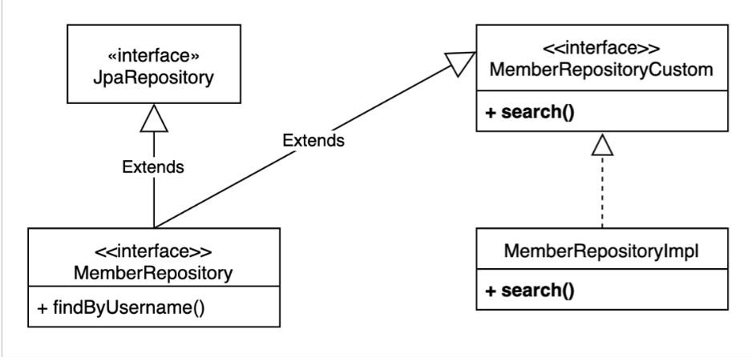

# 스프링 데이터 JPA 리포지토리로 변경

# 사용자 정의 리포지토리

### 사용자 정의 리포지토리 사용법

1. 사용자 정의 인터페이스 작성
2. 사용자 정의 인터페이스 구현
3. 스프링 데이터 리포지토리에 사용자정의 인터페이스 상속

### 사용자 정의 리포지토리 구성

### 참고

- 쿼리가 복잡하고 특정 기능에 특화된 검색조건 쿼리라면
- 따로 조회용 Repository로 빼서 구현해도 된다.
- 꼭 MemberRepositoryCustom에 구현하지 않아도 된다.

# 스프링 데이터 페이징 활용

- 스프링 데이터의 Page, Pageable을 활용해보자.
- 전체 카운트를 한번에 조회하는 단순한 방법
- 데이터 내용과 전체 카운트를 별도로 조회하는 방법

### 참고

Querydsl이 제공하는 fetchResult()을 사용하면 count 쿼리 최적화가 안된다.
count 쿼리를 최적화하면 만약 count 쿼리가 없다면 그다음 쿼리를 안날리는 등 별도의 최적화가 가능해진다.
따라서 count 쿼리를 웬만하면 최적화하는게 좋다.

# **스프링 데이터 페이징 활용2 - CountQuery 최적화**

- 스프링 데이터 라이브러리가 제공
- count 쿼리가 생략 가능한 경우 생략해서 처리
    - 페이지 시작이면서 컨텐츠 사이즈가 페이지 사이즈보다 작을 때
    - 마지막 페이지일 때 (offset + 컨텐츠 사이즈를 더해서 전체 사이즈 구함)

⇒ `new PageImpl<>` 대신 `PageableExecutionUtils.*getPage()`* 을 이용한다.

# 스프링 데이터 페이징 활용3 - 컨트롤러 개발

### 스프링 데이터 정렬(Sort)

- 스프링 데이터 JPA는 자신의 정렬(Sort)을 Querydsl의 정렬(OrderSpecifier)로 편리하게 변경하는 기능을 제공한다.

> 참고 : 정렬(’Sort’)은 조건이 조금만 복잡해져도 ‘Pageable’의 Sort 기능을 사용하기 어렵다. 루트 엔티티 범위를 넘어가는 동적 정렬 기능이 필요하면 스프링 데이터 페이징이 제공하는 Sort를 사용하기 보다는 파라미터를 받아서 직접 처리하는 것을 권장한다.
>